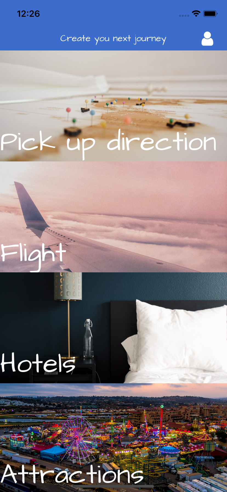
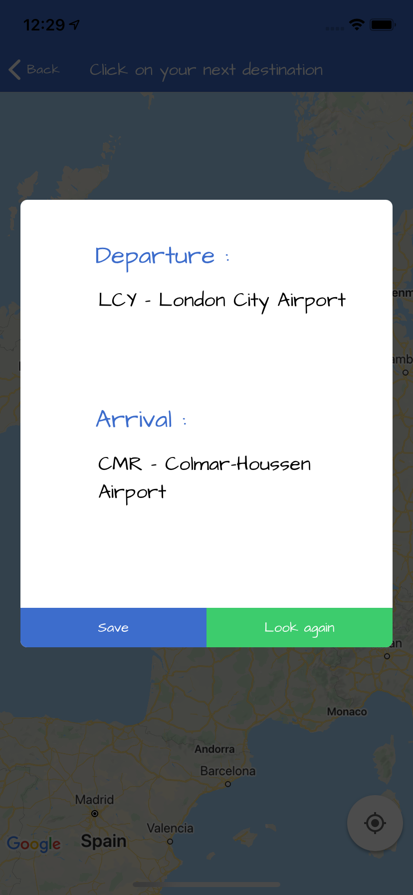

# Mobile Travel app (IOS)

Mobile Travel using ReactNative, Redux, Python as a server side and MongoDB for database. APIs that was used for now- skyscanner API, booking.com (bkscraper), opentripmaps, wikidata, API travel safe, alphavantage. This app using features like autolocation, camera and Google Maps and it's still in production (working for IOS).
## Main screeen:
Here we have 4 categories to choose: direction, flight, hotel, attractions and also login screen and some other features from menu.

## Direction screen:
After clicking on 'direction' user is moved to google maps screen and can pick up point on the map, also underline app memorize current location and after that pop up appears on the screen with some 4 closest airports from both places. User needs to choose from one of them and would be redirecting to screen with flight info (app picking up the cheapest connection).

  

## Flight screen:
User can manually add country and city for looking flight and then information appears(price, times and date info). Check photo above.

## Hotel screen:
User can check hotel prices for chosen city, result screen showing list of hotels with minimal prices, photo and after clicking redirecting to booking.com website to check availability.

## Attraction screen:
User can check attraction for choosen place or simply click on 'current location' and will be moved to result screen with list of result, after clicking on one of them pop up will appear with photo, short description, link to wikipedia page and also to maps(which can help to find best way).

## Login/Registration screen:
Login/ registration screen, all info saved in MongoDB.

